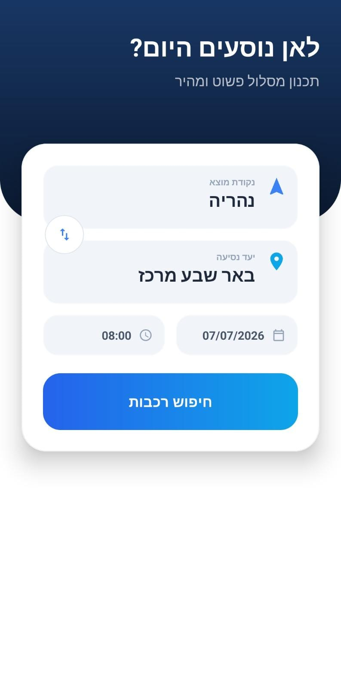
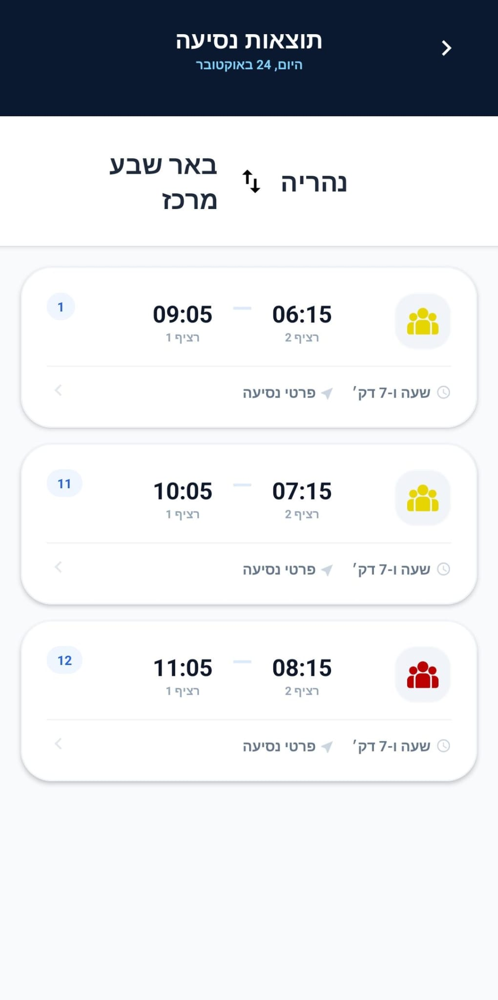
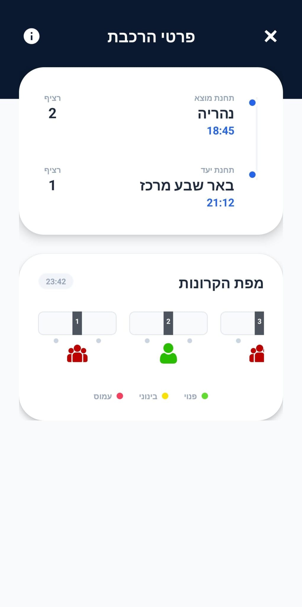
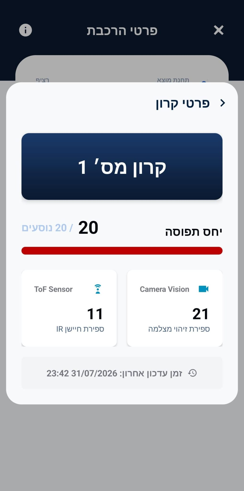

# Load Monitoring Client App

An **Android** (Kotlin) app for real-time monitoring of passenger load on trains.
The app lets passengers search for a train between two stations at a given date and time, view the list of matching trains, and drill into a specific train's details — including the **occupancy level of each individual carriage**, calculated from sensor data (cameras + IR sensors) provided by an external backend server (not included in this repo).

This project was built as a final project demonstrating an end-to-end public-transport load-monitoring system: sensors → server → a client app that presents the data to end users in a clear, visual way (color-coded occupancy levels: 🟢 low / 🟡 medium / 🔴 high) to help them pick a less crowded carriage.

---

## Screenshots


| Search screen | Trains list  | Train details | carriage details |
|---------------|--------------|--------------|------------------|
|   |  |  |      |

---

## Tech Stack

- **Kotlin** — primary development language
- **Android SDK** (minSdk 26, targetSdk 35, compileSdk 36)
- **MVVM** — architecture with separation into `ViewModel` / `Repository` / `Model`
- **Retrofit 3** + **OkHttp / Logging Interceptor** — HTTP communication with the API
- **Gson Converter** — JSON serialization/deserialization
- **Kotlin Coroutines & StateFlow** — asynchronous, reactive state management
- **AndroidX Lifecycle (ViewModel, Fragment-KTX)**
- **Material Components for Android** — UI (RecyclerView, BottomSheetDialog, MaterialDatePicker, etc.)
- **SwipeRefreshLayout** — pull-to-refresh data updates


---

## Installation & Setup

### Prerequisites
- [Android Studio](https://developer.android.com/studio) (recent version, supporting AGP 8.13+)
- JDK 11 or newer
- An Android emulator or physical device (minSdk 26 / targetSdk 35)
- The project's backend server running and reachable (separate project)

### Steps

1. **Clone the repository**
   ```bash
   git clone https://github.com/<your-org>/Load_Monitoring_Client.git
   cd Load_Monitoring_Client
   ```

2. **Configure the server URL**
   The app loads the API base URL from a `.env` file in the project root (not committed to git). Create a `.env` file at the root with the following line:
   ```
   BASE_URL=http://<server-ip>:<port>/
   ```
   > The URL must end with `/` .

3. **Open in Android Studio**
   Open the project (`File > Open`) and let Gradle sync the dependencies automatically.

   Or from the terminal:
   ```bash
   ./gradlew build
   ```

4. **Run**
   Select a device/emulator and click Run ▶️ in Android Studio, or:
   ```bash
   ./gradlew installDebug
   ```
---

## Usage

### Typical app flow
1. Open the app → search screen.
2. Pick an origin and destination station (with autocomplete populated from the server), a date and a time.
3. Tap **Search** → a list of matching trains is shown, color-coded by overall occupancy.
4. Tap a train → a details screen with all its carriages and their occupancy levels.
5. Tap a carriage → a dialog with live sensor data (camera count / IR count, occupancy percentage, last update time).

---

## License

MIT License

Copyright (c) 2026 Tomer Levy
